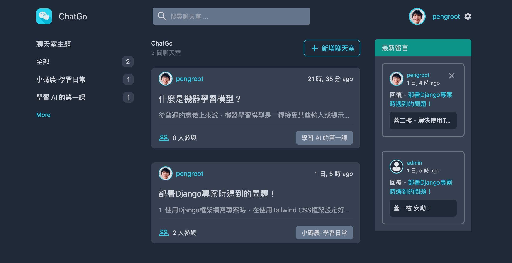
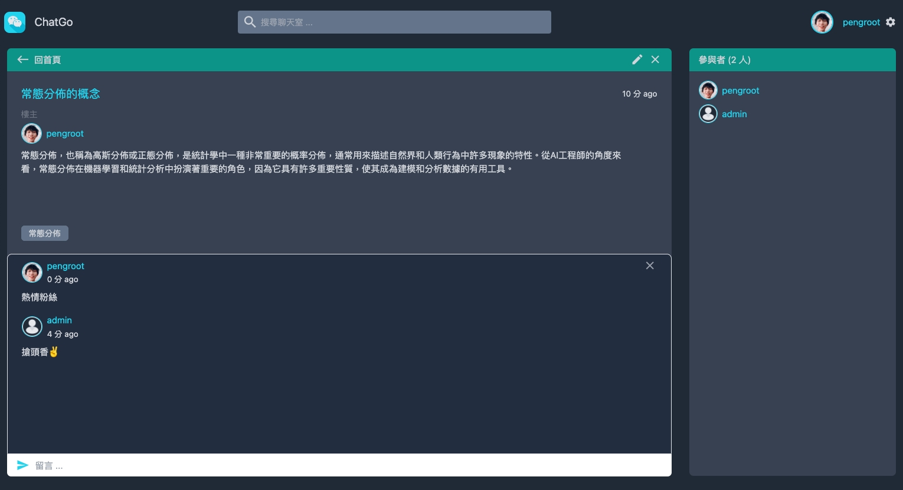
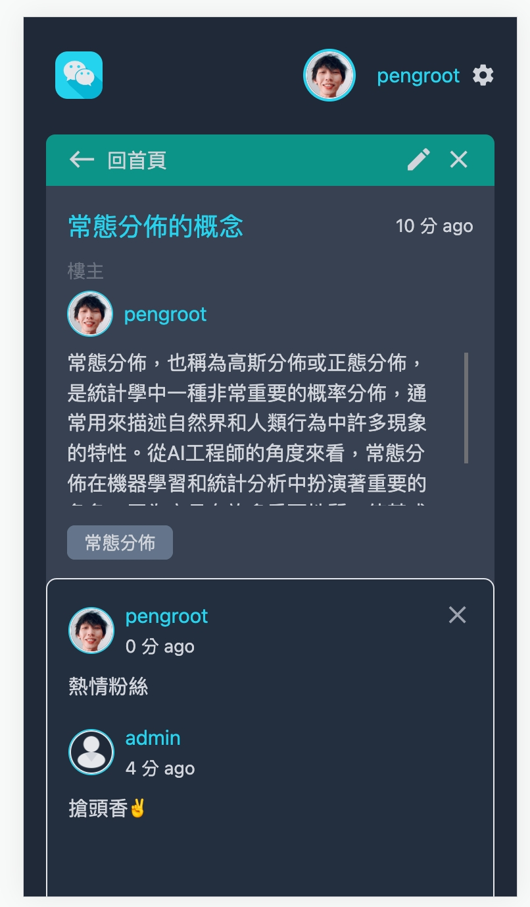

# ChatGo

> ⚠ Demo Website : https://chatgo-55d9.onrender.com

>⚠ 網頁執行時會比較慢，由於部署 Aws 時使用最低的 CPU 費率運行。

###  Preview :

<table width="100%"> 
<tr>
<td width="50%">      
&nbsp; 
 

  Web Home

</td> 
<td width="50%">
 

  Web Room 

</td>
</tr>
<tr>
<td width="50%">      
&nbsp; 
 

  App Home

</td> 
<td width="50%">
 

  App Room 

</td>
</tr>
</table>

#

## 專案說明
以聊天室為主題的公開討論網站。

### 設計概念
希望給朋友或家人有一個能夠互相分享資訊、共同討論話題的公開空間。

#
### 使用環境
- `Python3`。

### 使用技術
- 以 `Django` 框架架設開發。
- 使用 `Tailwind CSS` 框架為主，以進行切版。

### 使用套件
- `Django`
- `django-cors-headers`
- `djangorestframework`
- `mysqlclient`
- `Pillow`
- `PyMySQL`
- `whitenoise`
- `tailwind`
